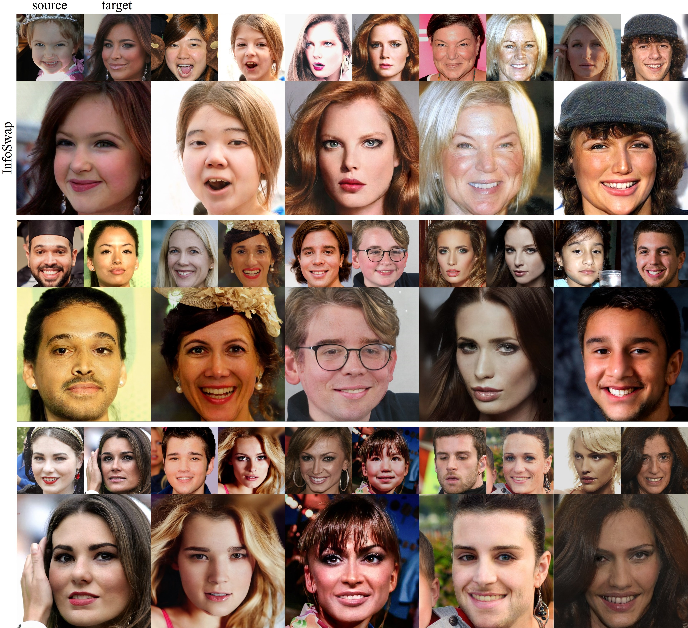
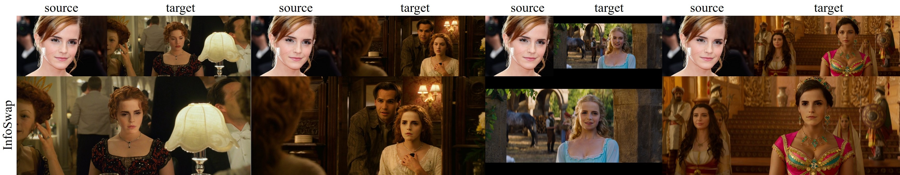

## InfoSwap: Information Bottleneck Disentanglement for Identity Swapping

### License

Copyright (C) 2021, CRIPAC, NLPR, CASIA. All rights reserved. Licensed under the CC BY-NC-SA 4.0 license ([https://creativecommons.org/licenses/by-nc-sa/4.0/](https://creativecommons.org/licenses/by-nc-sa/4.0/)).

### Code usage

Please check out the [user manual page](USAGE.md).

### Paper

[Gege Gao](https://scholar.google.com/citations?user=nYYIYaUAAAAJ), [Huaibo Huang](https://scholar.google.com/citations?user=XMvLciUAAAAJ), [Chaoyou Fu](https://scholar.google.com/citations?user=4A1xYQwAAAAJ), Zhaoyang Li, [Ran He](https://scholar.google.com/citations?user=ayrg9AUAAAAJ), "[Information Bottleneck Disentanglement for Identity Swapping](https://openaccess.thecvf.com/content/CVPR2021/html/Gao_Information_Bottleneck_Disentanglement_for_Identity_Swapping_CVPR_2021_paper.html)", CVPR 2021

### Results Across Large Gaps:


### Results of 1024x1024 Pixels:



### Results in Film Scenes:




### Citation

If you find this code useful for your research, please cite our paper:

```
@InProceedings{Gao_2021_CVPR,
    author    = {Gao, Gege and Huang, Huaibo and Fu, Chaoyou and Li, Zhaoyang and He, Ran},
    title     = {Information Bottleneck Disentanglement for Identity Swapping},
    booktitle = {Proceedings of the IEEE/CVF Conference on Computer Vision and Pattern Recognition (CVPR)},
    month     = {June},
    year      = {2021},
    pages     = {3404-3413}
}
```